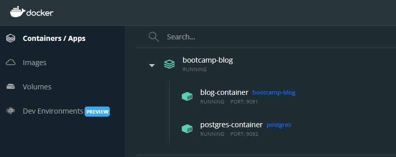
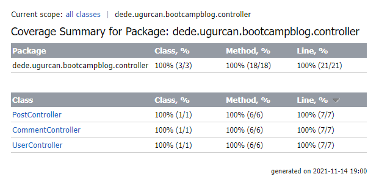
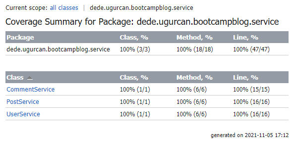
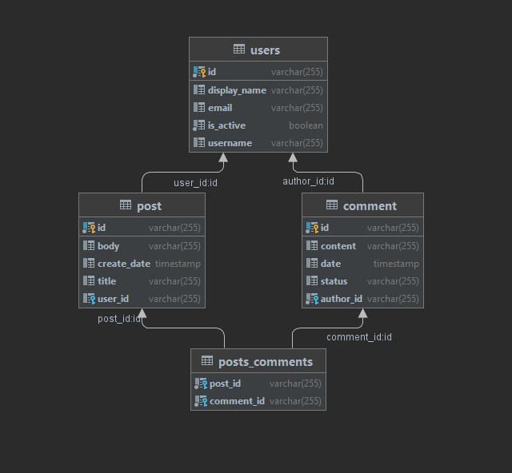
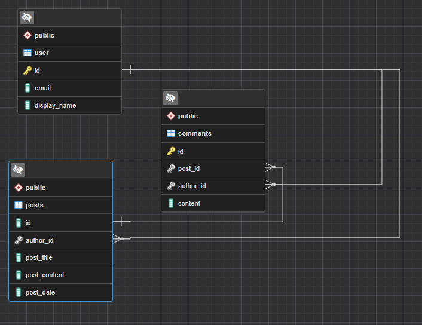

# Proje Commit Geçmişi

## [Hateoas (SelfLink)](https://github.com/ugurcandede/FolksDevBootcamp/commit/d9b88a49081dbde07ac6a5bbe6d3d08294eb31f5)

Blog projesine `Hateoas` desteği eklendi.

`GET` istekleri sonucunda, `_links` alanına `self` linki eklenerek, kullanıcıya `self` linki ile erişim sağlanır.

|   Controller   | Metot |                            Adres                            |
| :------------: | :---: | :---------------------------------------------------------: |
| UserController |  GET  | localhost:8080/v1/user/df4fa731-e8e4-4167-9e3e-574f266030bb |

```json
{
  "id": "df4fa731-e8e4-4167-9e3e-574f266030bb",
  "username": "nemesisce",
  "email": "cagridursun@folksdev",
  "displayName": "Cagri Dursun",
  "isActive": false,
  "posts": [
    {
      "id": "9fab6e1a-f790-4ef8-9f1b-a1fb3cd7227e",
      "title": "Lorem Ipsum",
      "body": "Lorem ipsum dolor sit amet, consectetur adipiscing elit. Sed a diam consectetur.",
      "createdAt": "2021-11-19T01:24:11.745724",
      "updatedAt": "2021-11-19T01:24:11.745724",
      "status": "PUBLISHED",
      "_links": {
        "self": {
          "href": "http://localhost:8080/v1/post/9fab6e1a-f790-4ef8-9f1b-a1fb3cd7227e"
        }
      }
    }
  ],
  "comments": [
    {
      "id": "d4a93866-0c93-4a6b-8e26-c24feb25e0bd",
      "body": "Hi Kod Gemisi",
      "createdAt": "2021-11-19T01:24:11.745724",
      "updatedAt": "2021-11-19T01:24:11.745724",
      "_links": {
        "self": {
          "href": "http://localhost:8080/v1/comment/d4a93866-0c93-4a6b-8e26-c24feb25e0bd"
        }
      }
    }
  ],
  "_links": {
    "self": {
      "href": "http://localhost:8080/v1/user/df4fa731-e8e4-4167-9e3e-574f266030bb"
    }
  }
}
```

## [Docker](https://github.com/ugurcandede/FolksDevBootcamp/commit/2aed7bbbe8c6ac78383427ce0d83120a7008d816)

Blog projesine `Docker` desteği eklendi.

[](https://github.com/ugurcandede/)

## [Open API/Swagger](https://bit.ly/3oBqER0)

Blog projesine `Open API/Swagger` desteği eklendi.

[](https://github.com/ugurcandede/)

## [Ödev 8](https://github.com/ugurcandede/FolksDevBootcamp/commit/fdecc5b2aae34b94277e1739c4bc92b77dbecec3)

Blog projenize ait `integration test`leri oluşturun.

[](https://github.com/ugurcandede/)

## [Ödev 7](https://github.com/Folksdev-camp/folksdev-ugurcandede/commit/fe699c9f8a9cd9ecfbef3df79d5a11cbeb3ab084)

Blog projenize ait servislerin `unit test`lerini oluşturun. **Code coverage 100%** yapın.

[](https://github.com/ugurcandede/)

## [Ödev 6](https://github.com/Folksdev-camp/folksdev-ugurcandede/commit/fe699c9f8a9cd9ecfbef3df79d5a11cbeb3ab084)

Blog projenizin servislerini oluşturun (CRUD), contoller ile çalışmasını sağlayın. Bir SQL dosyası oluşturarak, uygulama
ayağı kalkarken `flyway` kullanarak veri girişi yapmasını sağlayın.

| Metot |         Adres          |     Açıklama      |
| :---: | :--------------------: | :---------------: |
| POST  | localhost:8080/v1/post | Gönderi oluşturur |

```json
{
  "title": "Post Title",
  "body": "Lorem ipsum dolor sit amet, consectetur adipiscing elit. Sed a diam consectetur.",
  "status": "DRAFT"
}
```

---

| Metot |         Adres          |          Açıklama          |
| :---: | :--------------------: | :------------------------: |
|  GET  | localhost:8080/v1/post | Bütün gönderileri listeler |

```json
[
  {
    "id": "9e68a3e6-c531-4321-962f-0d333b5142ca",
    "title": "Hello",
    "body": "Hello Folksie!~",
    "creationDate": "2021-11-05T17:42:50.383426",
    "status": "PUBLISHED",
    "user": {
      "id": "7d5ddf73-0a64-43b0-b62b-2cd3dab5f2be",
      "username": "ugurcandede",
      "email": "ugur@dede.com",
      "displayName": "Ugurcan Dede"
    }
  },
  {
    "id": "001250ab-b76b-4f89-9dad-2d1e64719a17",
    "title": "Lorem Ipsum",
    "body": "Lorem ipsum dolor sit amet, consectetur adipiscing elit. Sed a diam consectetur.",
    "creationDate": "2021-11-05T17:42:50.542691",
    "status": "PUBLISHED",
    "user": {
      "id": "3403a2c4-241f-4a2b-8386-62c360d22ffe",
      "username": "nemesisce",
      "email": "cagridursun@folksdev",
      "displayName": "Cagri Dursun"
    },
    "comments": [
      {
        "id": "1fa4ddee-9453-47df-ad0e-bc78e9d71dae",
        "body": "Hi Kod Gemisi",
        "creationDate": "2021-11-05T17:42:50.542691"
      }
    ]
  }
]
```

---

| Metot |                            Adres                            |                            Açıklama                            |
| :---: | :---------------------------------------------------------: | :------------------------------------------------------------: |
|  GET  | localhost:8080/v1/post/9e68a3e6-c531-4321-962f-0d333b5142ca | ID 9e68a3e6-c531-4321-962f-0d333b5142ca olan gönderiyi getirir |

```json
{
  "id": "9e68a3e6-c531-4321-962f-0d333b5142ca",
  "title": "Hello",
  "body": "Hello Folksie!~",
  "creationDate": "2021-11-05T17:42:50.383426",
  "status": "PUBLISHED",
  "user": {
    "id": "7d5ddf73-0a64-43b0-b62b-2cd3dab5f2be",
    "username": "ugurcandede",
    "email": "ugur@dede.com",
    "displayName": "Ugurcan Dede"
  }
}
```

---

| Metot |                            Adres                            |                             Açıklama                             |
| :---: | :---------------------------------------------------------: | :--------------------------------------------------------------: |
|  PUT  | localhost:8080/v1/post/88147f8c-791b-43ff-ad05-bfb4c1786aff | ID 88147f8c-791b-43ff-ad05-bfb4c1786aff olan gönderiyi günceller |

```json
{
  "id": "ba49d411-df37-4fb3-9de8-1ede14d74f37",
  "title": "Updated title",
  "body": "Updated body",
  "createdAt": "2021-11-06T01:42:00.100413",
  "updatedAt": "2021-11-06T04:12:37.9239274",
  "status": "PUBLISHED",
  "user": {
    "id": "c4db6180-cd30-4253-ba53-b3d73547a4c8",
    "username": "ugurcandede",
    "email": "ugur@dede.com",
    "displayName": "Ugurcan Dede"
  }
}
```

---

| Metot  |                            Adres                            |                           Açıklama                           |
| :----: | :---------------------------------------------------------: | :----------------------------------------------------------: |
| DELETE | localhost:8080/v1/post/88147f8c-791b-43ff-ad05-bfb4c1786aff | ID 88147f8c-791b-43ff-ad05-bfb4c1786aff olan gönderiyi siler |

```text
ba49d411-df37-4fb3-9de8-1ede14d74f37 deleted
```

### Flyway

```bash
  INFO 11164 --- [  restartedMain] o.f.c.internal.license.VersionPrinter    : Flyway Community Edition 7.7.3 by Redgate
  INFO 11164 --- [  restartedMain] o.f.c.i.database.base.DatabaseType       : Database: jdbc:postgresql://localhost:5432/blog (PostgreSQL 14.0)
  WARN 11164 --- [  restartedMain] o.f.c.internal.database.base.Database    : Flyway upgrade recommended: Flyway upgrade recommended: org.flywaydb.core.internal.database.postgresql.PostgreSQLDatabaseType@7131dad0 14.0 is newer than this version of Flyway and support has not been tested. The latest supported version of org.flywaydb.core.internal.database.postgresql.PostgreSQLDatabaseType@7131dad0 is 13.
  INFO 11164 --- [  restartedMain] o.f.core.internal.command.DbValidate     : Successfully validated 5 migrations (execution time 00:00.021s)
  INFO 11164 --- [  restartedMain] o.f.core.internal.command.DbMigrate      : Current version of schema "public": 1
  INFO 11164 --- [  restartedMain] o.f.core.internal.command.DbMigrate      : Migrating schema "public" to version "1.1 - create user"
  INFO 11164 --- [  restartedMain] o.f.c.i.s.DefaultSqlScriptExecutor       : 0 rows affected
  INFO 11164 --- [  restartedMain] o.f.core.internal.command.DbMigrate      : Migrating schema "public" to version "1.2 - create post"
  INFO 11164 --- [  restartedMain] o.f.c.i.s.DefaultSqlScriptExecutor       : 0 rows affected
  INFO 11164 --- [  restartedMain] o.f.core.internal.command.DbMigrate      : Migrating schema "public" to version "1.3 - create comment"
  INFO 11164 --- [  restartedMain] o.f.c.i.s.DefaultSqlScriptExecutor       : 0 rows affected
  INFO 11164 --- [  restartedMain] o.f.core.internal.command.DbMigrate      : Migrating schema "public" to version "1.4 - insert user"
  INFO 11164 --- [  restartedMain] o.f.c.i.s.DefaultSqlScriptExecutor       : 1 rows affected
  INFO 11164 --- [  restartedMain] o.f.core.internal.command.DbMigrate      : Successfully applied 4 migrations to schema "public", now at version v1.4 (execution time 00:00.154s)
```

## [Ödev 5](https://github.com/Folksdev-camp/folksdev-ugurcandede/commit/99c9f829cd6d939b417f027c6e3492ac47d87b5b)

Blog projesine ait modellere birer repository oluşturarak `CommandLineRunner` sınıfında bu repositoryleri kullanın.

```
CommentedPost:
    Post(id = f6c4b575-32f5-4f77-ade2-042332bb85b7, title = Hello, body = Hello Folksie!~, createDate = 2021-10-29T14:37:56.793229,
            user = username = ugurcandede, email = ugur@dede.com, displayName = Ugurcan Dede, isActive = false)
```

```
ID -> 95151a40-8614-4429-a44e-f622b80359b9
	 Data -> username = ugurcandede , email = ugur@dede.com , displayName = Ugurcan Dede , isActive = false
ID -> d430371a-f085-4845-9702-60e41e105c73
	 Data -> username = nemesisce , email = cagridursun@folksdev , displayName = Cagri Dursun , isActive = false
```

## [Ödev 4](https://github.com/Folksdev-camp/folksdev-ugurcandede/commit/fa8bee2d48a4ddfa08bfd7a10572f1960c25e55d)

Blog projesine ait `Entry`, `Comment` ve `User` modelleri oluşturup aralarındaki ilişkiyi kurun.

[](https://github.com/ugurcandede/)

## [Ödev 3](https://github.com/Folksdev-camp/folksdev-ugurcandede/commit/adbf59c670c8a2c897cb7cb2887bae8df5d0cdd0)

Projenize ait bir veritabanı oluşturun, blog ve yorumları çekebileceğiniz bir sorgu yazın. Yazdığınız sorgu kodunu
projedeki `resource` kısmına SQL dosyası olarak ekleyin.

> resource'a veritabanı dump olarak eklendi.

<details>
<summary>SQL Tablo Oluşturma Kodları </summary>

"User" Tablosu Oluşturma

```sql
create table if not exists "user"
(
    id           varchar not null,
    email        varchar,
    display_name varchar,
    constraint user_pk
        primary key (id)
);
```

---

"Posts" Tablosu Oluşturma

```sql
create table if not exists posts
(
    id           varchar,
    author_id    varchar,
    post_title   varchar,
    post_content varchar,
    post_date    date,
    constraint posts_user_id_fk
        foreign key (author_id) references "user"
);
```

---

"Comments" Tablosu Oluşturma

```sql
create table if not exists comments
(
    id        varchar not null,
    post_id   varchar,
    author_id varchar,
    content   varchar,
    constraint comments_pk
        primary key (id),
    constraint comments_user_id_fk
        foreign key (author_id) references "user",
    constraint comments_posts_id_fk
        foreign key (post_id) references posts (id)
);
```

---

`INSERT` Komutları

```sql
INSERT INTO public."user" (id, email, display_name)
VALUES ('1', 'ugur@dede.com', 'Ugurcan Dede'),
       ('2', 'cagri@folksdev.com', 'Cagri Dursun');
```

```sql
INSERT INTO public.posts (id, author_id, post_title, post_content, post_date)
VALUES ('2', '2', 'Hello', 'Hello Folksie!~', '2021-10-21');
```

```sql
INSERT INTO public.comments (id, post_id, author_id, content)
VALUES ('1', '2', '1', 'Hi Kod Gemisi');
```

</details>

<details>
<summary>SQL Sorguları</summary>

```sql
SELECT u.display_name AS "User", c.content AS "Comment"
FROM "user" AS u
         INNER JOIN comments AS c ON c.author_id = u.id
```

|     User     |    Comment    |
| :----------: | :-----------: |
| Ugurcan Dede | Hi Kod Gemisi |

---

```sql
SELECT u.display_name AS "User",
       p.post_title   AS "Post Title",
       p.post_content AS "Post Content",
       p.post_date    AS "Post Date"
FROM "user" AS u
         INNER JOIN posts AS p ON p.author_id = u.id;
```

|     User     | Post Title |  Post Content   | Post Date  |
| :----------: | :--------: | :-------------: | :--------: |
| Cagri Dursun |   Hello    | Hello Folksie!~ | 2021-10-21 |

---

```sql
SELECT u.display_name AS "User", p.post_title AS "Post Title", c.content as "Comment"
FROM "user" AS u
         LEFT JOIN comments c ON u.id = c.author_id
         INNER JOIN posts p ON c.post_id = p.id
```

|     User     | Post Title |    Comment    |
| :----------: | :--------: | :-----------: |
| Ugurcan Dede |   Hello    | Hi Kod Gemisi |

</details>

[](https://github.com/ugurcandede/)

## [Ödev 2](https://github.com/Folksdev-camp/folksdev-ugurcandede/commit/761b611194f62bf00269ca399be43f1ec9c36a9b)

Projeye dummy `CRUD` api oluşturup, validasyonları hazırlama.

- POST` Metot İsteği

```json
{
  "name": "Blade",
  "year": 1998,
  "imdbScore": 7.1,
  "genre": ["action", "horror"]
}
```

## [Ödev 1](https://github.com/Folksdev-camp/folksdev-ugurcandede/commit/d862b9106133b364bf86ba610215381b7dbac322)

Blog projesi oluşturma ve GitHub'a yükleme.
